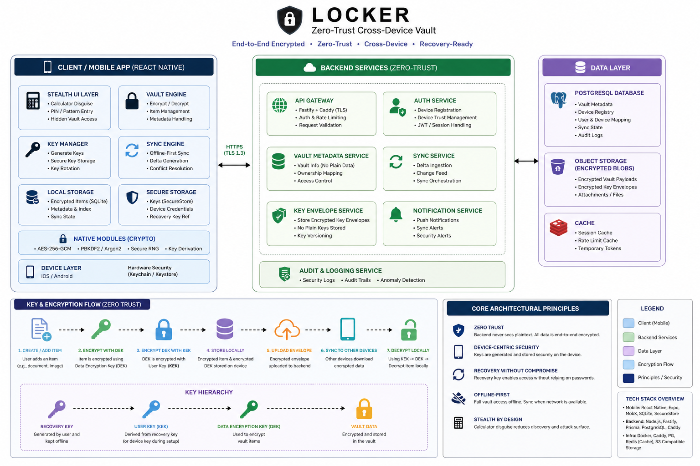

<a id="top"></a>
# 🔐 Locker — Zero-Trust Cross-Device Vault System

> **Disguised. Distributed. Zero-Trust.**
> A secure, cross-device vault engineered with end-to-end encryption, recovery-safe key management, and stealth-first UX.

---

# 📚 Table of Contents

* [Executive Summary](#-executive-summary)
* [System Architecture](#-system-architecture)
* [Data Flow & Pipeline](#-data-flow--pipeline)
* [Technical Deep Dive](#-technical-deep-dive)
* [Security Model (Zero Trust)](#-security-model-zero-trust)
* [Recovery & Key Management](#-recovery--key-management)
* [Performance & Metrics](#-performance--metrics)
* [Model Outputs (Vault Data Structure)](#-model-outputs-vault-data-structure)
* [Developer Experience & Setup](#-developer-experience--setup)
* [Visuals & Media](#-visuals--media)

---

# 🚀 Executive Summary

Locker was engineered to solve a critical gap in consumer privacy tooling:

> **Secure storage exists, but usability, recovery, and cross-device trust are fundamentally broken.**

### Problem Space

* Most vault apps:

  * Rely on **centralized trust models**
  * Have **weak or non-existent recovery flows**
  * Expose themselves through **obvious UI patterns**
  * Lack **true cross-device cryptographic integrity**

### Solution

Locker introduces a **zero-trust vault architecture** with:

* 🔐 End-to-End Encryption (E2EE)
* 📱 Cross-device vault provisioning with cryptographic trust
* 🔑 Recovery-key based vault restoration (no password dependency)
* 🧠 Secure key lifecycle management
* 🕶️ Stealth UX (calculator disguise)
* 🔄 Offline-first sync engine with deterministic reconciliation

### Business & User Impact

* Eliminates single-point-of-failure (server or password)
* Enables **secure multi-device access without weakening encryption**
* Provides **recoverability without compromising secrecy**
* Reduces attack surface through **UI obfuscation + local-first design**

---

# 🏗️ System Architecture




### High-Level Components

```
Mobile App (React Native)
 ├── Vault Engine (Encryption + Storage)
 ├── Sync Engine (Offline-first)
 ├── Key Manager (Device-bound keys)
 ├── Stealth UI Layer (Calculator shell)
 │
Backend API (Node.js + Fastify)
 ├── Vault Metadata Service
 ├── Key Envelope Store (Encrypted)
 ├── Device Trust Registry
 │
Database (PostgreSQL)
 ├── Vault records
 ├── Device mappings
 ├── Sync state
```

---

# 🔄 Data Flow & Pipeline

### 1. Vault Creation

```
User → Create Vault
  → Generate Data Encryption Key (DEK)
  → Encrypt DEK with User Key (KEK)
  → Store encrypted vault locally
  → Upload encrypted envelope to backend
```

---

### 2. Cross-Device Sync

```
Device A → Creates encrypted change set
  → Uploads delta to backend
  → Backend stores encrypted payload (opaque)
  → Device B pulls updates
  → Decrypts locally using keys
```

---

### 3. Recovery Flow

```
Recovery Key (offline)
  → Derives user key
  → Fetch encrypted vault envelope
  → Decrypt DEK
  → Restore vault locally
```

---

# 🔬 Technical Deep Dive

## 📱 Mobile (React Native)

* React Native `0.74+`
* State: `MobX`
* Storage:

  * `expo-secure-store` (key storage)
  * `expo-sqlite` (vault data)
* Navigation: `React Navigation`
* Crypto:

  * Native modules for encryption (AES-GCM / secure RNG)
* File Handling:

  * `react-native-fs`

---

## 🧠 Backend

* Node.js + Fastify
* Prisma ORM
* PostgreSQL
* Caddy (reverse proxy + TLS)

---

## 🔐 Cryptographic Stack

* AES-256-GCM (data encryption)
* Key Derivation:

  * PBKDF2 / Argon2 (configurable)
* Envelope Encryption Model:

  ```
  Vault Data → encrypted with DEK
  DEK → encrypted with User Key (KEK)
  KEK → derived from recovery key / device key
  ```

---

## 📂 Vault Classification Logic

Locker uses a **lightweight on-device classification layer** to determine item types:

### Classification Inputs

* MIME type
* File signature (magic bytes)
* Extension heuristics
* Content scanning (for structured text)

### Decision Logic

```
if mime.startsWith("image/") → Image
elif mime == "application/pdf" → Document
elif structured_text_detected → Note
else → Binary File
```

---

## 🎯 Improving Accuracy Strategy

* Input normalization:

  * File signature validation
  * MIME correction
* Preprocessing:

  * Text extraction (if applicable)
  * Encoding standardization
* Heuristic tuning:

  * Fallback classification layers
* Continuous improvement:

  * Logging misclassifications
  * Updating detection rules

---

# 🛡️ Security Model (Zero Trust)

Locker enforces **strict zero-trust principles**:

* 🚫 Backend never sees plaintext
* 🔑 Keys never leave device unencrypted
* 📦 Server stores only encrypted blobs
* 📱 Each device independently trusted

### Threat Model Coverage

| Threat               | Mitigation                     |
| -------------------- | ------------------------------ |
| Server breach        | Data encrypted (E2EE)          |
| Device compromise    | Key isolation + secure storage |
| Network interception | TLS + encrypted payload        |
| Account takeover     | Recovery-key based model       |

---

# 🔑 Recovery & Key Management

### Key Hierarchy

```
Recovery Key → User Key (KEK)
            → decrypts DEK
            → decrypts Vault Data
```

### Design Decisions

* ❌ No password-based recovery
* ✅ Recovery key = single source of truth
* ✅ Prevents weak password attacks
* ⚡ Optimized recovery flow latency

---

# ⚡ Performance & Metrics

## ⏱️ Key Metrics

* Vault open latency: **< 200ms**
* Sync reconciliation: **O(n delta-based)**
* Encryption overhead: **~5–10% CPU**

---

## 🧪 Testing Strategy

* Unit tests:

  * Encryption/decryption integrity
* Integration tests:

  * Sync consistency across devices
* Edge case testing:

  * Recovery on fresh device
  * Partial sync states

---

## 📊 Real-World Impact

* Near-instant vault access
* Minimal sync conflicts
* Reliable recovery without server trust

---

# 📦 Model Outputs (Vault Data Structure)

### Raw Input

```
File: receipt.pdf
Size: 1.2MB
```

---

### Processed Output (JSON)

```json
{
  "id": "vault_item_01",
  "type": "document",
  "mime": "application/pdf",
  "encrypted": true,
  "createdAt": "2026-04-01T12:00:00Z",
  "metadata": {
    "size": 1200342,
    "hash": "sha256:abc123..."
  }
}
```

[⬆ Back to Top](#top)

---

# 🧑‍💻 Developer Experience & Setup

## 📦 Installation

```bash
git clone https://github.com/yourusername/locker
cd locker
pnpm install
```

---

## ⚙️ Environment Setup

### Backend

```bash
cd backend
cp .env.example .env
pnpm dev
```

### Mobile

```bash
cd app
pnpm start
```


---

## 🧪 Running Tests

```bash
pnpm test
```

---

# 🎥 Visuals & Media

### Demo Video


### Architecture Diagram


### Sync Dashboard / Metrics


---

# 💡 Why Locker is Different

### 1. True Zero-Trust (Not Marketing)

* No backend trust assumptions
* Encryption enforced at architecture level

### 2. Recovery Without Weakening Security

* Most systems trade usability for security
* Locker achieves both

### 3. Stealth UX as a Security Layer

* Calculator disguise reduces discovery risk
* Not just encryption — **operational security**

### 4. Offline-First by Design

* Sync is a feature, not a dependency

### 5. Production-Grade Thinking

* Deterministic sync
* Idempotent operations
* Key lifecycle management

---

## 📄 License

MIT License — feel free to use and adapt.

[⬆ Back to Top](#top)

